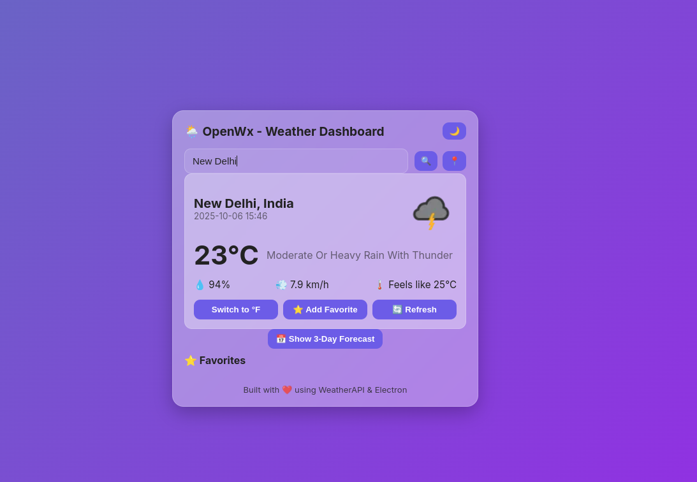
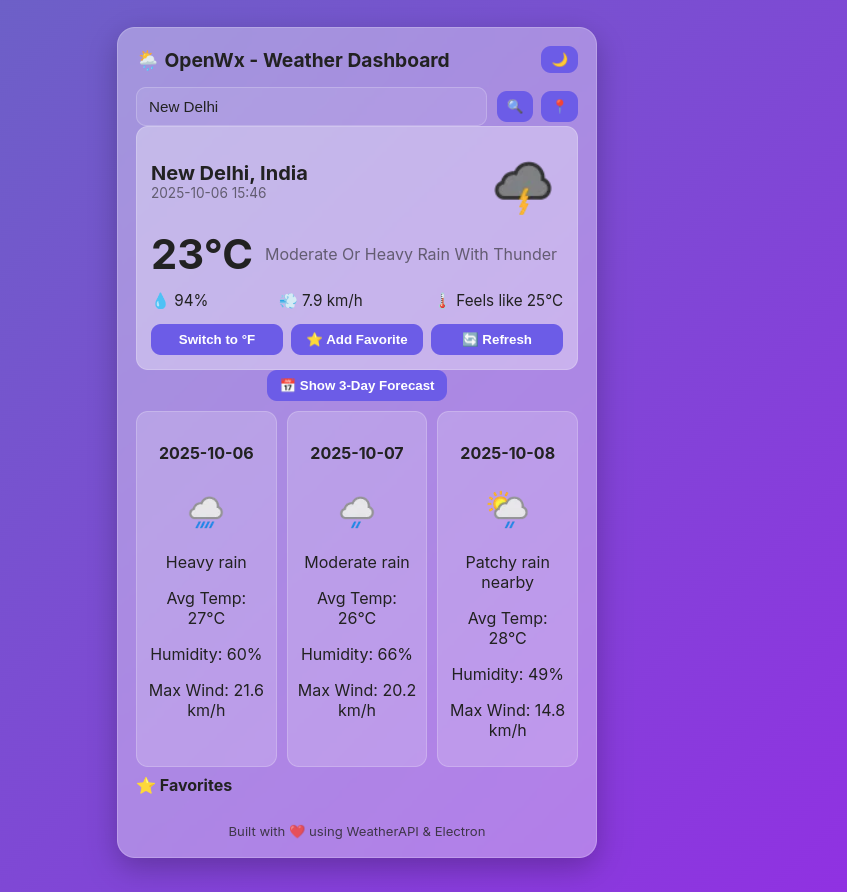
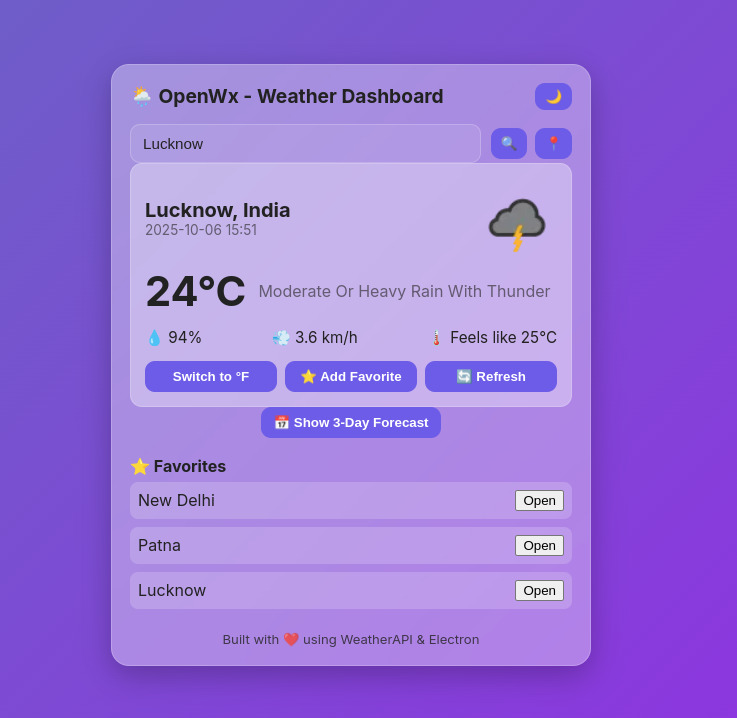

OpenWx is a **modern, secure, cross-platform weather app** built with **Electron**. 
It fetches real-time weather data .

## Features

- 🌍 **Current Weather:** Search any city to see temperature, humidity, and conditions.  
- 📍 **Auto-Location:** Detect user’s location and display local weather.  
- ⭐ **Favorite Cities:** Save a list of favorite cities for quick access.  
- 🌡️ **Unit Switching:** Toggle between Celsius and Fahrenheit.  
- 🖌️ **Clean UI:** Minimal, modern, dynamic background based on weather.  
- 🔄 **Manual Refresh:** Refresh weather data for the current city.  


## Screenshots


#### Dashboard


#### 3 Day ForeCast


#### Theme



## Installation/Usage

### Linux 
#### Appimage (Recommended)

- Download the latest OpenWx **'.AppImage'** from [Releases](https://github.com/nish12965/OpenWx/releases)
- Make it executable
```chmod +x OpenWx-1.0.0-x86_64.AppImage```
- Run the App
  ```./OpenWx-1.0.0-x86_64.AppImage```

### Windows

#### Portable Exe
- Download the latest OpenWx **'.exe(Portable)'** from [Releases](https://github.com/nish12965/OpenWx/releases)
- Double-click the **.exe** to run — no installation needed.

## 🧩 Platform Compatibility & Build Info

This app has been **developed and tested on Fedora 42 (KDE Plasma)** using Linux as the primary environment.  
All builds and packaging were performed on this platform.

### 🖥️ Build Summary

| Platform | Build Type | Build Method | Status |
|-----------|-------------|---------------|---------|
| **Linux** | `.AppImage` | Built natively on Fedora using `electron-builder` | ✅ Tested & Stable |
| **Windows** | `.exe` (Setup & Portable) | Built using [Wine](https://www.winehq.org/) compatibility layer on Linux | ✅ Tested on Windows 10/11 |
| **macOS** | `.dmg` (To be added) | Requires macOS environment for packaging | 🚧 Not Yet Built |

> **Note:**  
> macOS users can still run the app directly from **source** using Node.js and npm.

### Contribution Welcome!

- macOS contributors are especially welcome to help create and test a proper .dmg installer build.

### 🍎 Running on macOS (from source)

- Clone the repository & installl dependecies & Run it:
   ```bash
   git clone https://github.com/nish12965/OpenWx.git
   cd OpenWx
   npm install
   npm run dev


## Licence 
- This project is licenced under the **GNU general Public Licence v3 (GPL-3.0)**
- See more details here, [GPL v3 licence](https://www.gnu.org/licenses/gpl-3.0.en.html).


